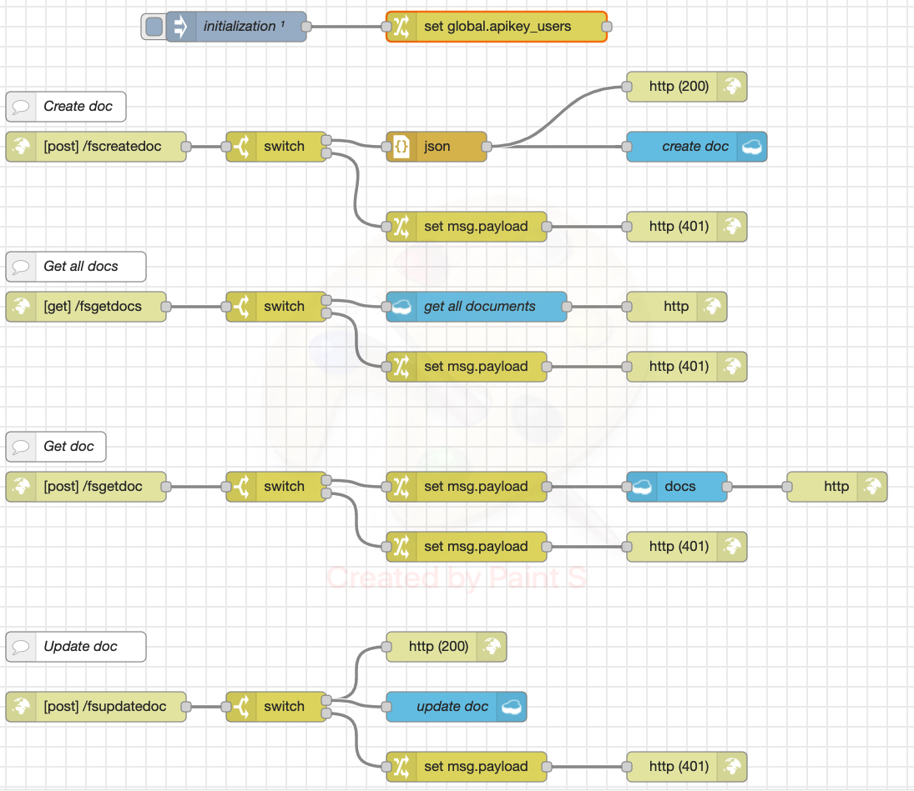

# Node-RED Backend

This solution consists of two parts:
1. Cloudant-CRUD: can be used to perform CREATE, READ, UPDATE and DELETE operations against a Cloudant database. It is an simple way to provide data store for hackathons, prototypes etc.
2. Simple Forwarding Server (needed to provide an interface to Web frontends)

** UNDER CONSTRUCTION **

# Prequisites
- IBM Cloud account

# Instructions
- install Node-RED, create a Cloudant service and bind the Cloudant service to the Node-RED app, see [A SHORT INTRODUCTION OF THE NODE-RED STARTER KIT ON IBM CLOUD FOR HACKATHONS](https://suedbroecker.net/2020/03/09/a-short-introduction-of-the-node-red-starter-kit-on-ibm-cloud-for-hackathons/)
- import the [Node-RED flow](https://github.com/gitjps/Node-RED-Cloudant-CRUD/blob/master/Node-RED.json) 
- Deploy the flow

# Endpoints
- Create doc
- Get all docs
- Get doc
- Update doc
- Delete doc

# How it works
The API key is set when the flow starts (initialization node).
When a request is received (e.g. *Create doc*), the header parameter *apikey*  is checked first. If it is not correct, a 401 error is thrown. Otherwise the requested actions is performed.

**Note** that REST calls in flows cannot be invoked directly from a web application, please vae a look [here](/simple_forward_server).
